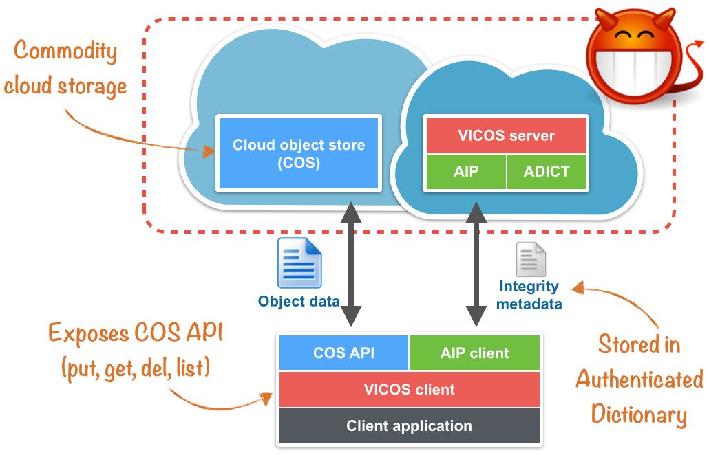

Verification of Integrity and Consistency for Cloud Object Storage (VICOS)
==========================================================================


What is VICOS?
--------------

VICOS is a system for verification of integrity and consistency of cloud
object storage. It enables a group of mutually trusting clients to detect
data-integrity and consistency violations when accessing cloud storage. In
particular, it aims at services where multiple clients cooperate on data
stored remotely on a potentially misbehaving service. VICOS enforces the
consistency notion of fork-linearizability, supports wait-free client
semantics for most operations, and has low computation and communication
overhead.

The VICOS system protects data stored on cloud (object) storage services, such
as OpenStack Swift or Amazon S3.

The implementation of VICOS follows the design presented and published in the
paper:

* Marcus Brandenburger, Christian Cachin, Nikola Knezevic:
  Don't trust the cloud, verify: integrity and consistency for cloud
  object stores. SYSTOR 2015.
  DOI [10.1145/2757667.2757681](http://dx.doi.org/10.1145/2757667.2757681)


Architecture and components
---------------------------

The following diagram shows the architecture of VICOS:



The VICOS system consists of three components:

1. A *cloud object store (COS)* service, as offered by commercial providers.
   It maintains the object data (bulk data) stored by the clients using VICOS.

1. The *VICOS server* that runs remotely as a cloud services accessed by the
   VICOS client; it stores integrity-specific metadata of the object data
   being outsourced to the cloud storage service.  The metadata is protected
   through the AIP protocol for a simple kay-value store.
   
1. The *VICOS client* enables clients to access the cloud storage service
   and transparently protect the integrity and consistency of their object
   data. It exposes the cloud object store interface to a client
   application. During each operation, the VICOS client consults the cloud
   object store (using a COS API) for the object data itself and the VICOS
   server for integrity-specific metadata (through an AIP client). The
   integrity-specific metadata consists of an unique key of an object in
   the COS and its cryptographic hash.
   
The cloud object store and the VICOS server are *both in the untrusted
domain*; they may, in fact, collude together against the clients.

VICOS is written in Java, which is required to run the client and the server.
 

Getting started
---------------

The following steps guide you through the build phase and configuration, for
deploying and running your own instance of VICOS (client and server) on your
machine.


### Requirements

VICOS can be installed and run on any platform with at least **Java 8** and **Gradle
version 2.13 or newer**. You can verify your platform using the following command: 
```
$ gradle -version

------------------------------------------------------------
Gradle 2.14
------------------------------------------------------------

Build time:   2016-06-14 07:16:37 UTC
Revision:     cba5fea19f1e0c6a00cc904828a6ec4e11739abc

Groovy:       2.4.4
Ant:          Apache Ant(TM) version 1.9.6 compiled on June 29 2015
JVM:          1.8.0_91 (Oracle Corporation 25.91-b14)
OS:           Linux 4.4.0-24-generic amd64
```

Furthermore, you need access to a cloud object store,
such as Openstack Swift or an account for Amazon S3. For testing purpose we
recommend to get a setup like [Swift All in One](http://docs.openstack.org/developer/swift/development_saio.html).

### Building VICOS

1. Clone VICOS to your local environment from your terminal using

        $ git clone git@github.com:ibm-research/vicos.git

1. `cd` into this newly created directory

1. Build VICOS by just calling the following command
    
        $ gradle installDist

This will build, test, and package the VICOS core library, the VICOS
server, and the VICOS client CLI, a sample command-line interface
application for demonstrating its functions . When the build has been
successful, you find the outputs in the corresponding directories:

* ```vicos/vicos-core/build/libs```
* ```vicos/vicos-server/build/install/vicos-server```
* ```vicos/vicos-client-cli/build/install/vicos-server```

The developer guide section later explains how to integrate the VICOS
core library into an application and how to extend it. The next section
illustrates how to configure the sample client CLI application of VICOS
included with the distribution.


### Configuration

**NOTE** -- *Although support for RSA and DSA public-key signatures is in
the protocol implementation, the corresponding key-management functions are
not yet provided.  The configuration therefore only explains how to use
VICOS with HMAC keys.*

The first step is to configure the **VICOS server**.  Edit the file
`server.conf` located
in `vicos-server/build/install/vicos-server/conf` and change
`hostname` and `port` in the `server` section to the IP address and
port where the VICOS server will be reachable.
Optionally, you can set the maximum number of pending operation at the
server.  Limiting the number of pending operations prevents the system
from becoming unstable.

An example VICOS server configuration:
```
include "application"

akka {
  loglevel = "INFO"
}

vicos {
  server {
    hostname = 127.0.0.1
    port = 2775
  }
  
  system {
    flowcontrol.pending-list-max-length = 128
  }
}
```

Now configure and deploy the **VICOS clients**.  For each client edit the file
`client.conf` located in `vicos-client-cli/build/install/vicos-client-
cli/conf`.  An example client configuration is shown below.  The parameters of
the `cos` section are directly given to the jclouds library for configuring
the BlobStore provider: here you need to define `provider`, `endpoint`,
`identity`, and `credential`.  For example, a local OpenStack Swift deployment
(SAIO), one could have the parameters `provider = "swift"`, `endpoint =
"http://127.0.0.1:8080/auth"`, and `identity = "account:user"`.

Additionally, specify the parameters of the VICOS server in the `server`
section as defined earlier in the `server.config` file.  This contains the
hostname and a port where the server listens.  Every client must have a unique
name, which is specified here in `identifier`.

In order to run VICOS with the default signature implementation
you need to generate an HMAC key that is used by **all** clients.
This is a symmetric 128-bit key for HMAC-SHA1. The following command
creates such a key and outputs it as a base64-formatted string:

    $ openssl rand 16 -base64 

Insert the output in the `hmac.key` field of the client configuration.

An example VICOS client configuration:

```
include "application"
 
cos {
  provider = "PROVIDER"
  endpoint = "http://ADDR:PORT"
  identity = "ACCOUNT:USER"
  credential = "SECRET"
}


vicos {
  server {
    hostname = "127.0.0.1"
    port = 2775
  }

  client {
    identifier = "Client-001"
  }

  system {
    signatures {
      type = "HMAC"
      // Shared key has to be created initially and distributed among all clients.
      // Create a key by running "openssl rand 16 -base64"
      hmac.key = "SECRET_AS_BASE64_STRING"
    }
  }
}
```


### Running VICOS

You are now ready to start the VICOS server and use the VICOS client
application to upload data to the cloud object store.


#### VICOS server

- Start the VICOS server:
 
        $ cd vicos-server/build/install/vicos-server/
        $ ./bin/vicos-server
        
- The server is now up and running, and waiting for initialization by a client
  (see below). The VICOS server console provides this set of commands:
    
  * `help` - List all commands usage
  * `exit` - Exits the shell and stops the server
  * `status` - Shows current server status
  * `history` - Shows history of all operations invoked so far
  * `authenticators` - Shows all authenticators
    
- Moreover, the VICOS server provides also a set of commands to manipulate the
  data stored in the server. Those are for demonstration purpose only and 
  simulate malicious behavior by the server. Note that any
  modification to the integrity-specific metadata are integrity violations and
  may be detected by the VICOS clients.

  Data manipulation commands:
  * `get` - Gets the value for a key
  * `put` - Stores a key-value pair
  * `del` - Deletes a value-key pair
  * `list` - Lists all keys

    
#### VICOS client

- Start the VICOS client CLI:

        $ cd vicos-client-cli/build/install/vicos-client-cli/
        $ ./bin/vicos-client-cli
        
- When the VICOS client starts, it tries to establish connections to the
  cloud storage server and the VICOS server. Before a group of clients may
  start using the system, a single user has to initialize the VICOS server
  using the `init` command.  This command resets the VICOS server; all
  data stored previously will be lost.

- You can now use the VICOS client CLI to store data in the VICOS-protected
  cloud storage service, using the following commands:

  General:
  * `help` - List all commands usage
  * `exit` - Exits the shell and stops the client

  Container operations:
  * `createcontainer` - Creates a container
  * `deletecontainer` - Deletes a container
   
  Blob operations:
  * `putblob` - Uploads a blob from source path
  * `getblob` - Downloads a blob to destination path
  * `deleteblob` - Deletes a blob

- The following commands shows how to use the VICOS client; initializing the
  VICOS server, creating a container, uploading a file, and finally
  downloading the same file again.

  ```
  # init the VICOS server
  vicos-cli>init
  Server successfully initialized

  # create a container
  vicos-cli>createcontainer --container my_test_container
  Container successfully created

  # upload a file
  vicos-cli>putblob --container my_test_container --src /tmp/my_test_file
  Successfully uploaded my_test_container/my_test_file

  # download a file
  vicos-cli>getblob --container my_test_container --blob my_test_file --dest_path /tmp/download
  Successfully downloaded /tmp/download/my_test_file [35120 bytes]
  ```


Developer notes
---------------


### Implementation details

The VICOS client uses the BlobStore interface of [Apache jclouds](https://jclouds.apache.org/) for connecting to different cloud object stores (in the COS API).
Jclouds offers a simplified API and supports different cloud providers such as
[Microsoft Azure Blob Storage](https://azure.microsoft.com/en-us/services/storage/),
[Amazon S3](https://aws.amazon.com/s3/), or
[OpenStack Swift](http://swift.openstack.org/). Check the jclouds
[documentation](https://jclouds.apache.org/reference/providers/) for all
supported cloud providers.

The VICOS server runs as a standalone web service, communicating with the
VICOS client using the [Akka](http://www.akka.io) framework. Akka is an event-
driven framework which supports the actor model. The client as well as
the VICOS code are implemented as actors within the framework. Actors are
independent units which can only communicate by exchanging messages. Every
actor has a mailbox that buffers all incoming messages. By default messages
are processed in FIFO order by the actor. This allows the server protocol
implementation to process all incoming messages sequentially and execute each
protocol step atomically, that is, mutually exclusive with respect to all
others. For more detailed information see the
[Akka documentation](http://akka.io/docs/).

The VICOS server provides a simple key-value store (KVS) functionality,
implemented by an authenticated dictionary (ADICT).  The data objects
themselves are outsourced to the cloud storage service, and the server
maintains only integrity-specific metadata.  More precisely, the KVS state
is a map supporting GET, PUT, DEL, and LIST operations.  The server stores
the integrity-specific metadata of an object under the object's key in the
cloud object store.  The VICOS client translates object keys (the names of
objects) before accessing the cloud object store.  The translation
appends the client identifier and a operation counter to the keys, and the
client also stores them in the metadata of the object.  This translation is
needed in order to support two concurrent operations that access the same
object and might interfere with each other.  Translation creates distinct
names for the object in the cloud object store and this prevents that the
system gets into an inconsistent state.

The cryptographic signatures used in VICOS can be implemented in multiple
ways. In the security model for VICOS, all clients trust each other, the
server alone may act maliciously, and only clients issue digital
signatures. Therefore, VICOS may use standard digital signatures, but also
provides a simplified trust model with "signatures" provided by a
message-authentication code (MAC). For many applications, where strong
mutual trust exists among the clients, MACs suffice and will result in
faster execution. On the other hand, this simplification renders the system
more fragile and may expose it more easily to attacks by malicious clients.
In particular, VICOS supports RSA and DSA signatures with 2048-bit keys and
HMAC-SHA1 with 128-bit keys, all provided by the Java Cryptography
Extension (JCE).  The signature implementation can be selected in the
configuration file, and the default choice is HMAC-SHA1.


### Application integration

The VICOS client has been developed in a way that simplifies integration
into existing applications to provide integrity protection. The
`VICOSBlobStore` offers a simple object store API, adding Java Exceptions
for signaling integrity and consistency violations as shown below:

```java
public interface VICOSBlobStore {

    void init(Config config);

    InputStream getObject(String container, String name) throws KeyNotFoundException, IntegrityException;

    void createContainer(String container);

    void createObject(String container, String name, InputStream data, long length) throws IntegrityException;

    void deleteContainer(String container);

    void deleteBlob(String container, String name) throws KeyNotFoundException, IntegrityException;

    void dispose();
}
```

Note that the protocol implemented by VICOS is structured into an active and a
passive phase.  That is, once a method from `VICOSBlobStore` returns, the
active phase ends and the passive phase continues asynchronously in the
background.  This allows client applications to continue without waiting for
the passive phase to finish and therefore reduces latency for the clients.


### Extending VICOS

VICOS uses a modular approach that allows developers to extend it with more
functions, for example, to support more complex applications than a cloud
object store. The developer only needs to implement the desired functionality
by defining the state, a set of operations, and their compatibility relation.
In VICOS there is already an implementation of a simple key-value
store functionality, realized by the authenticated dictionary (ADICT).

There are two interfaces to support this: `State` and `OperationProcessor`.
The `State` interface is a marker interface to model the protocol's
state; its implementations must only provide an initialization function
as follows:

```java
public interface State {
  void init();
}
```

The `OperationProcessor` is an abstract class. Its instantiations must
provide implementations of the methods `query`, `authexec`, `refresh`,
`isCompatible`, and `isUpdateOperation`.  They use parameters of type
`Operation` and `State`:

```java
public abstract class OperationProcessor<S extends State> {

  public abstract QueryResult query(S state, List<Operation> operation);

  public abstract AuthExecResult authexec(List<Operation> operation, Authenticator authenticator, Operations.Result result, AuxiliaryData auxiliaryData);

  public abstract S refresh(S state, Operation operation, AuxiliaryData auxiliaryData);

  public abstract boolean isCompatible(List<Operation> listOthers, Operation currentOperation);

  public abstract boolean isCompatible(Operation otherOperation, Operation currentOperation);

  public abstract boolean isUpdateOperation(Operation operation);
}
```

The KVS implementation in ADICT provides these methods with the `KVSState`
class, which maintains a tree map for keys and values of type string, and with
the `KVSOperationProcessor` class that executes KVS-specific operations on a
`KVSState`.

Operations are described using Google's [Protocol
Buffers](https://developers.google.com/protocol-buffers/) executed by the
`OperationProcessor`.

This modular concept allows to extend the core of VICOS, the AIP protocol, and
to tailor it to different applications.


References
----------

* Marcus Brandenburger, Christian Cachin, Nikola Knezevic:
  Don't trust the cloud, verify: integrity and consistency for cloud
  object stores. SYSTOR 2015.
  DOI [10.1145/2757667.2757681](http://dx.doi.org/10.1145/2757667.2757681)


Acknowledgment
---------------

The development has been supported in part by the European Commission in
the ICT programme under contracts ICT-2009-257243 TCLOUDS, and through
the Horizon 2020 Framework Programme (H2020-ICT-2014-1) under grant
agreements number 644371 WITDOM and 644579 ESCUDO-CLOUD and in part by
the Swiss State Secretariat for Education, Research and Innovation
(SERI) under contracts number 15.0098 and 15.0087.


License
-------

Copyright IBM Corp. 2016 All Rights Reserved.

Licensed under the Apache License, Version 2.0 (the "License");
you may not use this file except in compliance with the License.
You may obtain a copy of the License at

    http://www.apache.org/licenses/LICENSE-2.0

Unless required by applicable law or agreed to in writing, software
distributed under the License is distributed on an "AS IS" BASIS,
WITHOUT WARRANTIES OR CONDITIONS OF ANY KIND, either express or implied.
See the License for the specific language governing permissions and
limitations under the License.
